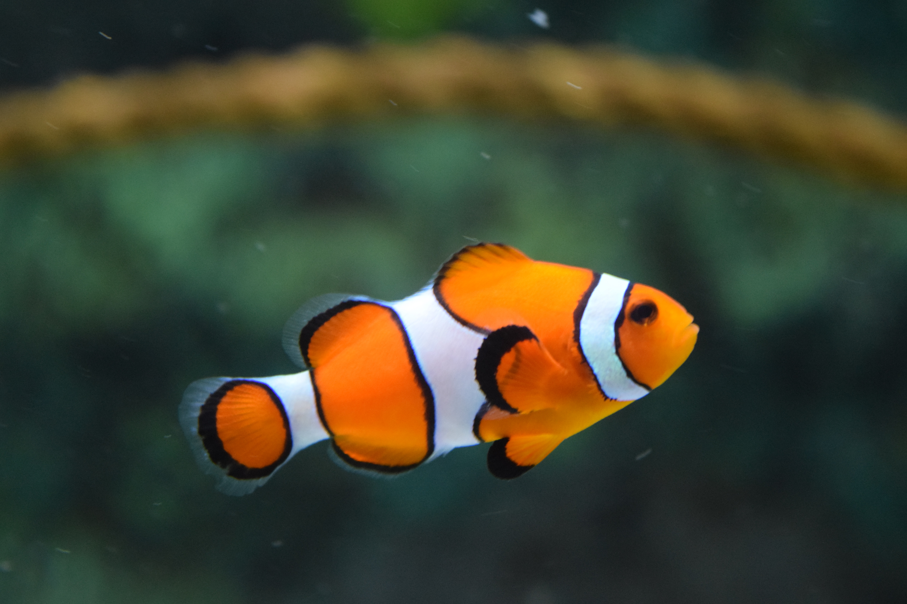

## Hey there 🐬
### My name is **Sima** and this is my first time coding, I am taking class because the course seemed cool when I read about it. I am very intrested in learning all about coding and improving all of my skills. I have recently taken a robotics class so I have some idea of basic coding and what I am doing, yet there is still so much I want to learn.
### [Here is a link of my last robotics project](https://drive.google.com/file/d/1gfWwSqtNetqFYWXZF32nCUpfigkFU7Zi/view?usp=sharing)

***
### Here is a divider

|    Animals    |    Colors     |
| ------------- |:-------------:|
| Donkeys       | Green.        |
| Whales        | Yellow        |
| Elaphants.    | Pink.         |

***

1. Lists are so much fun
2. They are easy to make
* And you have a lot of creativity with them
1. They allow you to be organgized
* And happy
4. Lists are so much fun

***

<dl>
  <dt>Happy</dt>
  <dd>Is a feeling of joy.</dd>

<!--
**simatabbaa/simatabbaa** is a ✨ _special_ ✨ repository because its `README.md` (this file) appears on your GitHub profile.

